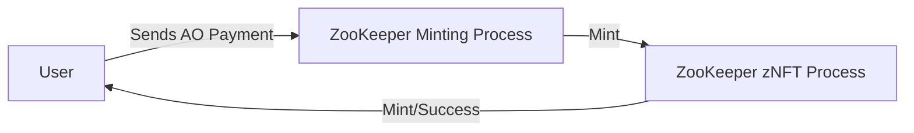
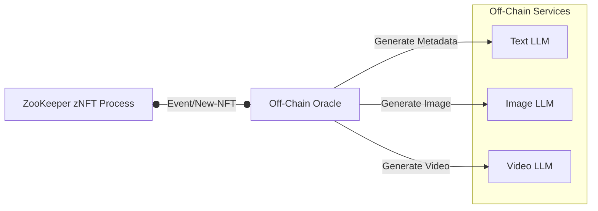
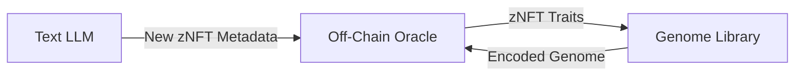
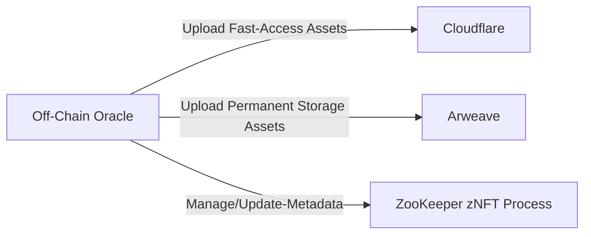

This page provides a detailed walkthrough of the Zoo Keeper Genesis minting process. The process transforms an AO token payment into a fully minted and enriched ZooKeeper NFT through a secure, multi-stage pipeline. Each stage is designed to ensure uniqueness, security, and integration of AI-driven enhancements.

## **1. Minting Initiation**

In this initial stage, an external minter triggers the [ZooKeeper Mint Process](#) by sending AO tokens as payment. Once the payment is received, a new NFT is minted with "empty" metadata, indicating that it awaits further enrichment.

<Callout>Mint Process has access only to `Mint` Handler via Guarded Access Roles.</Callout>

### Explanation:
- User Payment: The process starts when a user sends AO tokens.
- Mint Request: The external minting system (operating under the minter role) processes the payment and issues a mint request.
- Pending NFT Creation: The ZooKeeper zNFT process creates a new NFT with “pending” metadata, signaling that further metadata generation is needed.

## **2. Off-Chain Oracle & LLM Trigger:**

After minting, an off-chain oracle monitors the blockchain for new NFTs in a pending state. Upon detecting a new NFT, the oracle triggers an LLM to generate detailed token traits and additional metadata.

<Callout>Off-Chain Oracle has access only to `Manage/Update-Metadata` Handler via Guarded Access Roles.</Callout>

### Explanation:
- Oracle Monitoring: The off-chain oracle listens for events indicating new pending NFTs.
- LLM Integration: The text LLM is triggered to generate rich token traits and descriptions.
- Asset Generation: Parallel requests to image and video LLMs produce visual and video assets.

## **3. Genome Generation:**

The traits generated by the LLM are then processed by our custom [Genome Library](/docs/zoo-keepers/genome) (implemented in TypeScript). This module encodes the traits into a unique, compact genome string—a campaign-specific attribute that is later added to the NFT metadata.

### Explanation:
- Trait Transmission: The oracle forwards the generated traits to the Genome Library.
- Encoding Process: The Genome Library encodes the traits into a genome string, ensuring each NFT has a unique genetic blueprint.
- Result Integration: The encoded genome is then sent back to be integrated into the NFT’s metadata.

## **4. Asset Creation & Metadata Finalization:**

In the final stage, AI systems generate visual and video assets based on the enriched metadata. These assets are then stored on fast-access platforms like Cloudflare and on permanent storage solutions such as Arweave.

Finally, the off-chain oracle updates the NFT’s metadata to include these assets and the newly generated genome, completing the minting process.

<Callout>Off-Chain Oracle has access only to `Manage/Update-Metadata` Handler via Guarded Access Roles.</Callout>

### Explanation:
- Asset Generation: Visual and video assets are generated using AI technologies.
- Asset Storage: Assets are uploaded to Cloudflare for rapid access and to Arweave for permanent storage.
- Metadata Update: The off-chain oracle updates the NFT metadata with the asset links and the encoded genome, finalizing the minting process.

## Conclusion

The Zoo Keeper Genesis minting process is a robust pipeline that ensures each NFT is uniquely defined through AI-generated traits and a campaign-specific genome. By leveraging secure external minting, off-chain oracle monitoring, advanced LLM integrations, and efficient asset storage, our process lays a strong foundation for future evolution and interactive functionalities.

_For more detailed technical documentation, code samples, and integration guides, please refer to the respective sections in our documentation._